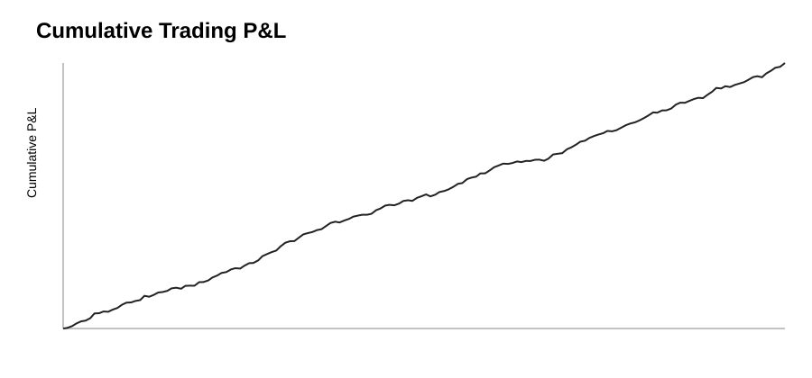
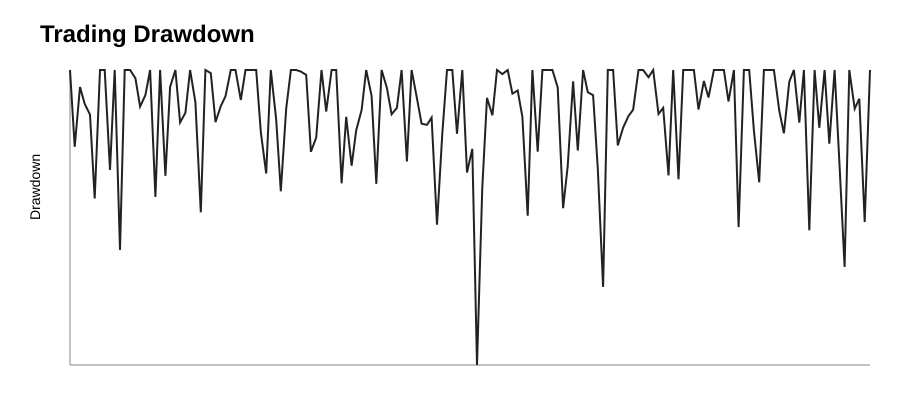
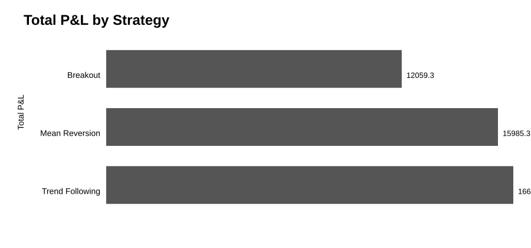
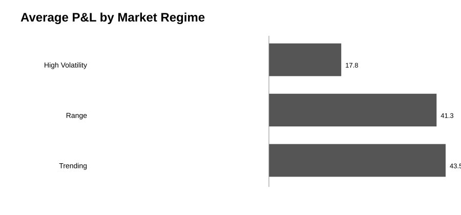

# Trading Risk & Performance Analytics

## Trade-level performance → risk-aware decisions

A recruiter-ready, reproducible financial analytics project that evaluates **performance, risk, drawdowns, expectancy, tail losses, concentration, and strategy behavior** using Python, SQL, statistical analysis, and visual reporting.

> **Portfolio focus:** separating headline return from the risk, concentration, and behavioral characteristics underneath it.

## Executive Dashboard

See the recruiter-facing interpretation layer: **[Executive Risk Dashboard](reports/executive_dashboard.md)**.

### Visual Analysis









The charts above are generated from the project's fixed-seed synthetic trade generator; they are committed as SVG so they render directly on GitHub.

## Analyst Snapshot

| Capability | Demonstrated here |
|---|---|
| Data preparation | Validation, cleaning, duplicate and risk checks |
| Performance analysis | P&L, win rate, profit factor, expectancy |
| Risk analysis | Drawdown, volatility, downside deviation, VaR/CVaR |
| Concentration | Top-winner P&L contribution |
| Segmentation | Strategy, instrument, session, market regime |
| SQL | Reusable business analysis queries |
| Communication | Executive risk dashboard and findings |
| Reproducibility | Fixed-seed dataset + tests + GitHub Actions |

## Business Questions

- Which strategies and instruments produce the strongest risk-adjusted behavior?
- What are win rate, profit factor, expectancy, and average return per trade?
- How deep and persistent are drawdowns?
- What do VaR and CVaR reveal about tail losses?
- Are results concentrated in a small number of winning trades?
- Which sessions and market regimes contribute most to performance?
- Where should risk controls or further investigation be prioritized?

## Analytical Workflow

```text
Synthetic Trade Data → Validation & Cleaning
        ↓
Performance Metrics → Drawdown & Tail Risk
        ↓
Concentration Analysis → Strategy / Instrument / Session / Regime Segmentation
        ↓
SQL → Visual Reporting → Decision Framework
```

## Advanced Analytics

| Area | Metrics |
|---|---|
| Performance | Total P&L, average trade, win rate, average win/loss |
| Efficiency | Profit factor, expectancy, return on risk |
| Risk | Max drawdown, drawdown %, P&L volatility, downside deviation |
| Tail risk | VaR 95%, CVaR 95% |
| Recovery | Recovery factor |
| Consistency | Loss streaks, variability |
| Concentration | Top-10%-winner P&L share |
| Segmentation | Strategy, instrument, session, market regime |

The Sharpe-style measure is deliberately labeled a **trade-level proxy** and is not presented as an annualized investment statistic.

## Tech Stack

**Python · pandas · NumPy · SQL · Matplotlib · Git/GitHub · GitHub Actions · pytest**

## Reproducibility

```bash
pip install -r requirements.txt
python src/generate_data.py
python src/clean_data.py
python src/performance_analysis.py
python src/risk_analysis.py
python src/create_visualizations.py
pytest -q
```

The synthetic dataset uses a fixed random seed. The visualization script now generates SVG outputs that are versioned in Git so the portfolio's visual layer is visible on GitHub.

## Data Integrity

All trading records are **synthetic** and created for portfolio demonstration. No private client, employer, brokerage, or account data is included. Results are not investment advice or evidence of future performance.

## Portfolio

Part of a three-project Data Analyst portfolio:

- **Macro Market Intelligence** — economic and market context
- **Trading Risk & Performance Analytics** — financial risk and performance
- **Customer Support Analytics** — business and operations analytics
